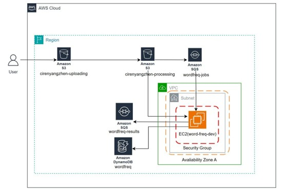
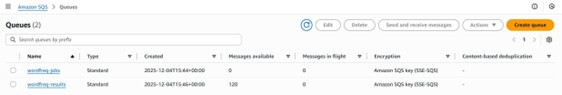

# AWS Scalable Word Frequency System

A cloud-based distributed text processing system with auto-scaling, built using AWS services including S3, SQS, EC2, and DynamoDB.

---

## Project Overview

This project implements a scalable data processing system on AWS that processes text files and extracts the top 10 most frequent words.

The system is designed to handle dynamic workloads by automatically scaling compute resources based on queue demand.

Key features:

* Distributed processing using message queues
* Auto-scaling based on workload
* Fully cloud-based architecture
* Fault-tolerant and scalable design

---

## System Architecture

The system consists of:

* **Amazon S3** — stores uploaded and processing files
* **Amazon SQS** — manages job queue and result queue
* **Amazon EC2** — processes text files
* **Amazon DynamoDB** — stores results

---

## Auto Scaling Design

Auto-scaling is implemented using:

* CloudWatch metrics (SQS queue length)
* Scaling policies for scale-out and scale-in
* Auto Scaling Group (ASG)

Unlike traditional systems, scaling is based on queue workload instead of CPU usage.

---

## Scaling Behaviour

The system dynamically scales:

* From 1 instance → up to 5 instances under heavy load
* Back to 1 instance when workload decreases

---

## Results

* Successfully processed 120 text files
* All results stored in DynamoDB
* Queue length reduced from 120 → 0

---

## Tech Stack

* AWS S3
* AWS SQS
* AWS EC2
* AWS DynamoDB
* AWS CloudWatch
* Auto Scaling

---

## Repository Structure

* `lsde-wordfreq-app/` — application source code
* `report.pdf` — full coursework report
* `images/` — system diagrams and results

---

## Notes

This project is based on postgraduate coursework and demonstrates practical skills in:

* Cloud architecture design
* Distributed systems
* Auto-scaling infrastructure
* Performance optimisation

---

## Future Improvements

* Replace EC2 with serverless architecture (AWS Lambda)
* Use AWS Batch or EMR for large-scale processing
* Add monitoring dashboard (CloudWatch + Grafana)
